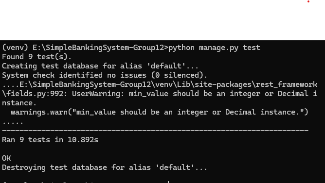
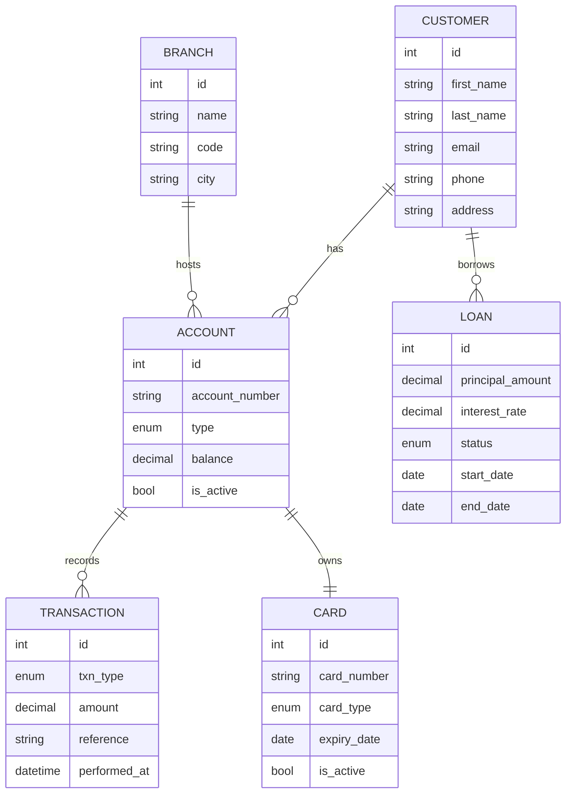

# Simple Banking System (Django REST Framework)

## Group Members
150140-Owen Kipkosgei
121238-Ogole Edgar
151751-Mary Ng'ang'a 
145768-Ogato Deborah Kerubo 
94944-Antony Wanderi
169648-Kamau Joseph Manene
167242-Nyoike Brian Njehia

## Project Overview
This project is a **Simple Banking System** implemented using Django and Django REST Framework (DRF).  
It provides API endpoints to manage **Accounts** and **Transactions** with full CRUD functionality, validation, and automated testing.  

---

## Step-by-Step Implementation

### 1. Models and Relationships

- **Customer** – first/last name, email (unique), phone (unique, validated), address.  
  *Relationship:* One **Customer** → Many **Accounts**, Many **Loans**.

- **Branch** – name, code (unique), city.  
  *Relationship:* One **Branch** → Many **Accounts** (PROTECT on delete).

- **Account** – account number (unique), type (Savings/Current), balance (non-negative), is_active.  
  *Relationship:* One **Customer** → Many **Accounts**; One **Branch** → Many **Accounts**; One **Account** → One **Card**.

- **Transaction** – account (FK), txn_type (Deposit/Withdraw), amount (>0), reference (unique), performed_at.  
  *Relationship:* One **Account** → Many **Transactions**.

- **Loan** – customer (FK), principal_amount (>0), interest_rate (≥0), status (Pending/Approved/Repaid), dates.  
  *Relationship:* One **Customer** → Many **Loans**.

- **Card** – account (OneToOne), card_number (16 digits, unique), card_type (Debit/Credit), expiry_date, is_active.

> All models inherit timestamps (`created_at`, `updated_at`) via an abstract  

---

### 2. Serializers and Validation

- **CustomerSerializer, BranchSerializer, AccountSerializer, CardSerializer, LoanSerializer, TransactionSerializer**
- Key validation rules:
  - `Account.balance` **cannot be negative**.
  - `Card.card_number` **must be exactly 16 digits**.
  - `Loan.principal_amount` **> 0**, `Loan.interest_rate` **≥ 0**.
  - `Transaction.amount` **> 0**; **withdrawals require sufficient balance**; **account must be active**.
  - `Transaction.create()` updates the linked account balance **atomically**.

---

### 3. Views / ViewSets
- **ModelViewSet** used for each model: `CustomerViewSet`, `BranchViewSet`, `AccountViewSet`, `CardViewSet`, `LoanViewSet`, `TransactionViewSet`.
- **Permissions:** `IsAuthenticated` (session login via `/api-auth/login/` or admin login).  

---

### 4. URL Patterns
Base prefix: `/api/`

- `/api/customers/`
- `/api/branches/`
- `/api/accounts/`
- `/api/cards/`
- `/api/loans/`
- `/api/transactions/`

Other helpful routes:
- `/admin/` – Django admin 

---

### 5. Testing Summary
We used Django’s **built-in testing framework** to validate functionality.  

**Test Cases Covered:**  
- ✅ Account creation and retrieval  
- ✅ Updating and deleting accounts  
- ✅ Creating valid deposits and withdrawals  
- ✅ Preventing withdrawals larger than balance  
- ✅ Ensuring account balance updates correctly after transactions  

---

## Testing Evidence

The following is the actual output from running `python manage.py test`:

## Live API Docs
- Swagger UI: `/docs/`
- OpenAPI JSON: `/schema/`

## Models & Relationships
> Mermaid ER diagram (renders on GitHub).  
> If it doesn’t render in your view, open `docs/er-diagram.mmd`.

